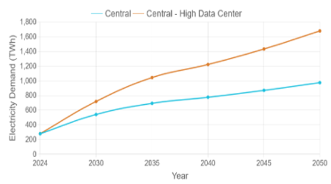
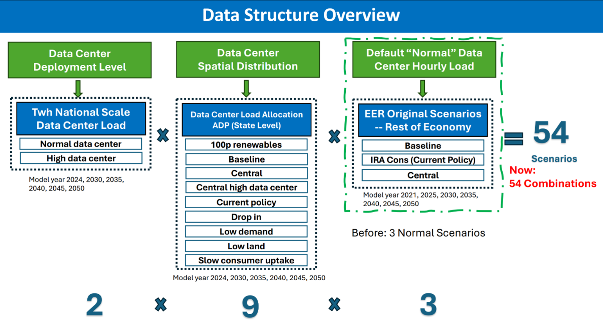
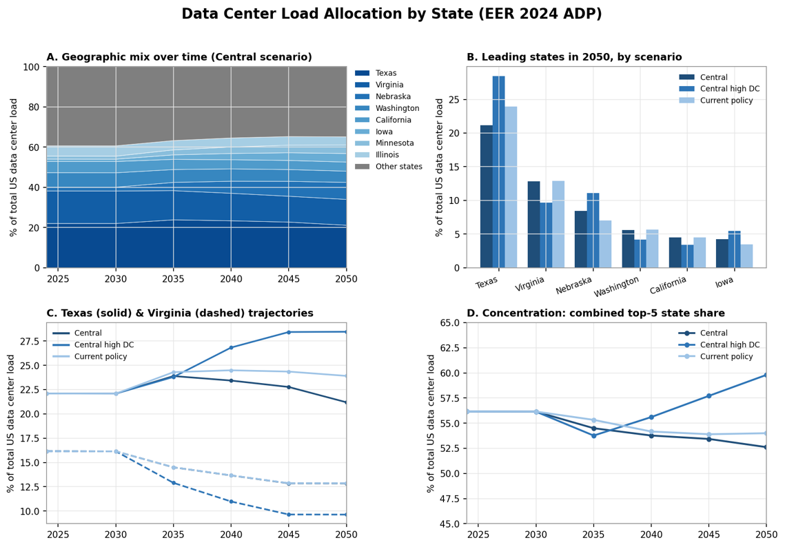
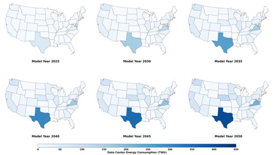

# Load Projections in ReEDS

*Memo to Exxon Mobil — June 30, 2026*

This memo summarizes the electricity load projections used in the ReEDS model, including overall demand assumptions and the treatment of data center demand. Data center load is summarized in its own section below.

## Overall load projections

ReEDS represents end-use electricity demand through annual energy and seasonal/diurnal load profiles. Default demand trajectories are drawn from Evolved Energy Research (EER) scenarios, which can be supplemented with sector-specific projections — including the data center demand described below.

![Three options for default load scenarios in ReEDS. See [@tbl:loadopts] for detailed descriptions of these options and also more possible load scenarios.](national_annual_demand.png){#fig:loadscenarios}

The load profile descriptions, data sources, and weather years included in each of the available load profiles are provided in @tbl:loadopts.

| Name | Description of Profile | Origin | Weather year included |
| --- | --- | --- | --- |
| Historic | Detrended historic demand from 2007-2013 and 2016-2023. This is multiplied by annual growth factors from AEO to forecast load growth. | Produced by the ReEDS team from a compilation of data sources. More detail can be found in the [hourlize readme](https://github.com/ReEDS-Model/ReEDS/tree/main/hourlize). | 2007-2013 & 2016-2023 |
| EFS Clean 2035 LTS | Net-zero emissions, economy wide, by 2050 based on the [White House's Long Term Strategy](https://www.whitehouse.gov/wp-content/uploads/2021/10/US-Long-Term-Strategy.pdf). | Developed for the [100% Clean Electricity by 2035 study](https://www.nlr.gov/docs/fy22osti/81644.pdf). | 2007-2013 |
| EFS Clean 2035 | Accelerated Demand Electrification (ADE) profile. This profile was custom made for the 100% Clean Electricity by 2035 study. More information about how it was formed can be found in [Appendix C of the study report](https://www.nlr.gov/docs/fy22osti/81644.pdf). | Developed for the [100% Clean Electricity by 2035 study](https://www.nlr.gov/docs/fy22osti/81644.pdf). | 2007-2013 |
| EFS Clean 2035 (top 1% clipped) | Same as Clean 2035 but clips off the top 1% of load hours. | Developed for the [100% Clean Electricity by 2035 study](https://www.nlr.gov/docs/fy22osti/81644.pdf). | 2007-2013 |
| EFS High | Features a combination of technology advancements, policy support and consumer enthusiasm that enables transformational change in electrification. | Developed for the [Electrification Futures Study](https://www.nlr.gov/docs/fy18osti/71500.pdf). | 2007-2013 |
| EFS Medium Stretch 2046 | An average of the EFS Medium profile and the AEO reference trajectory. This was created to very roughly simulate the EV and broader electrification incentives in IRA, before we had better estimates of the actual effects of IRA. | NLR researchers combined the EFS Medium profile and the AEO reference trajectory. | 2007-2013 |
| EFS Medium | Features a future with widespread electrification among the "low-hanging fruit" opportunities in electric vehicles, heat pumps and select industrial applications, but one that does not result in transformational change. | Developed for the [Electrification Futures Study](https://www.nlr.gov/docs/fy18osti/71500.pdf). | 2007-2013 |
| EFS Reference | Features the least incremental change in electrification through 2050, which serves as a baseline of comparison to the other scenarios. | Developed for the [Electrification Futures Study](https://www.nlr.gov/docs/fy18osti/71500.pdf). | 2007-2013 |
| EER 2023 Baseline (AEO 2022) | Business as usual load growth. Based on the service demand projections from AEO 2022. This does not include the impacts of the Inflation Reduction Act. | Purchased from Evolved Energy Research in June 2023 for the National Transmission Planning Study and to update our load profiles in general. More information can be found in [EER's 2022 Annual Decarbonization Report](https://www.evolved.energy/post/adp2022). This is the "Baseline" scenario in EER's 2022 ADP. | 2007-2013 |
| EER 2023 IRA Low | Modeling load change under conservative assumptions about the Inflation Reduction Act | Purchased from Evolved Energy Research in June 2023 for the National Transmission Planning Study and to update our load profiles in general. This scenario is unfortunately not described in EER's 2022 ADP. It was originally prepared for the Princeton REPEAT project. Please cite the [Princeton REPEAT project](https://repeatproject.org/) when using this profile. | 2007-2013 |
| EER 2023 IRA Moderate | Modeling load change under moderate assumptions about the Inflation Reduction Act | Purchased from Evolved Energy Research in June 2023 for the National Transmission Planning Study and to update our load profiles in general. This scenario is unfortunately not described in EER's 2022 ADP. It was originally prepared for the Princeton REPEAT project. Please cite the [Princeton REPEAT project](https://repeatproject.org/) when using this profile. | 2007-2013 |
| EER 2023 100% by 2050 | 100% decarbonization by 2050 scenario. This does not explicitly include the impacts of the Inflation Reduction Act. However, due to its decarbonization, it is a more aggressive electrification profile than EER 2025 IRA Low. | Purchased from Evolved Energy Research in June 2023 for the National Transmission Planning Study and to update our load profiles in general. More information can be found in [EER's 2022 Annual Decarbonization Report](https://www.evolved.energy/post/adp2022). This is the "Central" scenario in EER's 2022 ADP. | 2007-2013 |
| EER 2025 Baseline (AEO 2023) | Business as usual load growth. Based on the service demand projections from AEO 2023. This does not include the impacts of the Inflation Reduction Act. | Purchased from Evolved Energy Research in 2024. More information can be found in [EER's 2024 Annual Decarbonization Report](https://www.evolved.energy/us-adp-2024). This is the "Baseline" scenario in EER's 2024 ADP. | 2007-2013 & 2016-2023 |
| EER 2025 IRA Low | Modeling load change under conservative assumptions about the Inflation Reduction Act | Purchased from Evolved Energy Research in 2024. This scenario is not described in EER's 2024 ADP. It is most similar to the "Current Policy" scenario; however, that scenario has "moderate assumptions about the Inflation Reduction Act" compared to this scenario which has "conservative assumptions about the Inflation Reduction Act". This scenario was originally prepared for the Princeton REPEAT project. Please cite the [Princeton REPEAT project](https://repeatproject.org/) when using this profile. | 2007-2013 & 2016-2023 |
| EER 2025 100% by 2050 | 100% decarbonization by 2050 scenario. This does not explicitly include the impacts of the Inflation Reduction Act. However, due to its decarbonization, it is a more aggressive electrification profile than EER 2025 IRA Low. | Purchased from Evolved Energy Research in 2024. More information can be found in [EER's 2024 Annual Decarbonization Report](https://www.evolved.energy/us-adp-2024). This is the "Central" scenario in EER's 2024 ADP. | 2007-2013 & 2016-2023 |

: Descriptions of load scenario options. {#tbl:loadopts}

## Data center demand

This section summarizes data center loads used in the ReEDS model. Users can opt to use data center demand projections from Evolved Energy Research (EER) included in default ReEDS demand profiles or develop custom demand projections and capacity siting using NLR's reVeal tool.

### Evolved Energy Research projections

By default, ReEDS uses central data center demand and capacity projections from Evolved Energy Research's [2024 Annual Decarbonization Perspective](https://www.evolved.energy/us-adp-2024) ([@fig:dccentral]).

{#fig:dccentral}

EER developed these projections based on existing and planned data center projects from Baxtel data, as well as a literature review with expert consultation.  There are also other options available that can differ in data center deployment level, spatial distribution, and 'normal' data center hourly load ([@fig:dcoptions]).

{#fig:dcoptions}

Central data center load growth projections are included in the EER 2025 demand profiles (Baseline, IRA low, and 100% by 2050). EER 2025 demand profiles that have been modified to use EER's high data center demand projections are available internally.

Until 2030, EER sites data centers based on existing and planned data center capacity. After 2030, half of data center capacity is sited based on current trends in existing and planned data centers, and the other half is optimally sited to minimize the cost of the energy system.

[@fig:dcstate] summarizes the underlying state-level allocation data across model years and scenarios. Panel A shows how the geographic mix of data center load shifts over time under the central scenario, with Texas and Virginia consistently the two largest loads. Panel B compares the leading states in 2050 across the central, central high data center, and current policy scenarios. Panel C traces the Texas and Virginia trajectories, and Panel D shows the combined share of the top five states as a measure of geographic concentration.

{#fig:dcstate}

The map below shows the regional mix of data center load geographically, illustrating how consumption concentrates in a small number of states — most notably Texas — and deepens through 2050 ([@fig:dcregional]).

{#fig:dcregional}

### Custom data center demand & capacity projections

Custom data center capacity projections can be sited using NLR's [reVeal](https://docs.nlr.gov/docs/fy26osti/99256.pdf) tool. Data center capacity siting outputs from the reVeal tool can be translated into hourly demand profiles using the reVeal2ReEDS pipeline in ReEDS. These hourly demand profiles can then be used to modify 2025 EER demand profiles with custom data center demand projections.

## References

*REPEAT | Rapid Energy Policy Evaluation **&** Analysis Toolkit*. ZERO lab at Princeton University. Retrieved June 30, 2026, from [https://repeatproject.org](https://repeatproject.org)

Zuckerman, G., Igwe, V., & Williams, T. (2026). Leveraging reVeal for Data Center Siting. [https://docs.nlr.gov/docs/fy26osti/99256.pdf](https://docs.nlr.gov/docs/fy26osti/99256.pdf)

National Laboratory of the Rockies. (2026, June). Model documentation — ReEDS 2.0. [https://reeds-model.github.io/ReEDS/model_documentation.html](https://reeds-model.github.io/ReEDS/model_documentation.html)

Evolved Energy Research | Consulting on Energy Transformation. (2024). Evolved Energy Research. Retrieved June 30, 2026, from [https://evolved.energy](https://evolved.energy)
